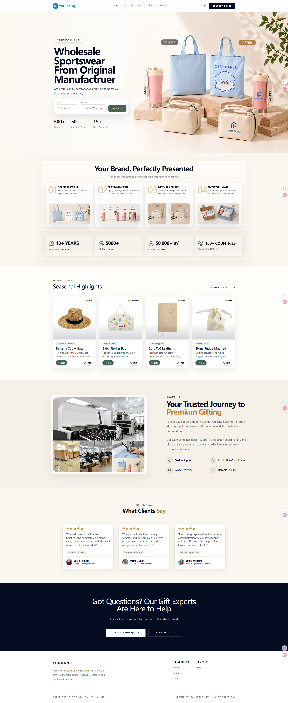
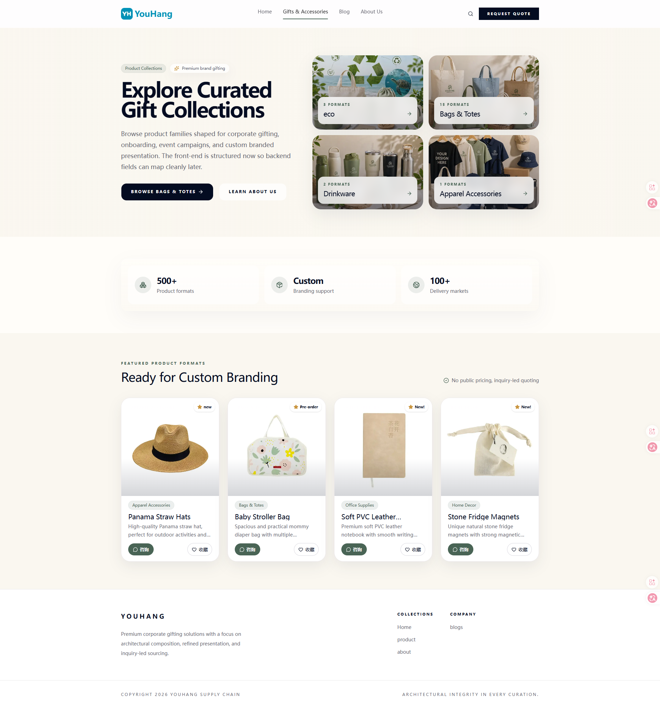
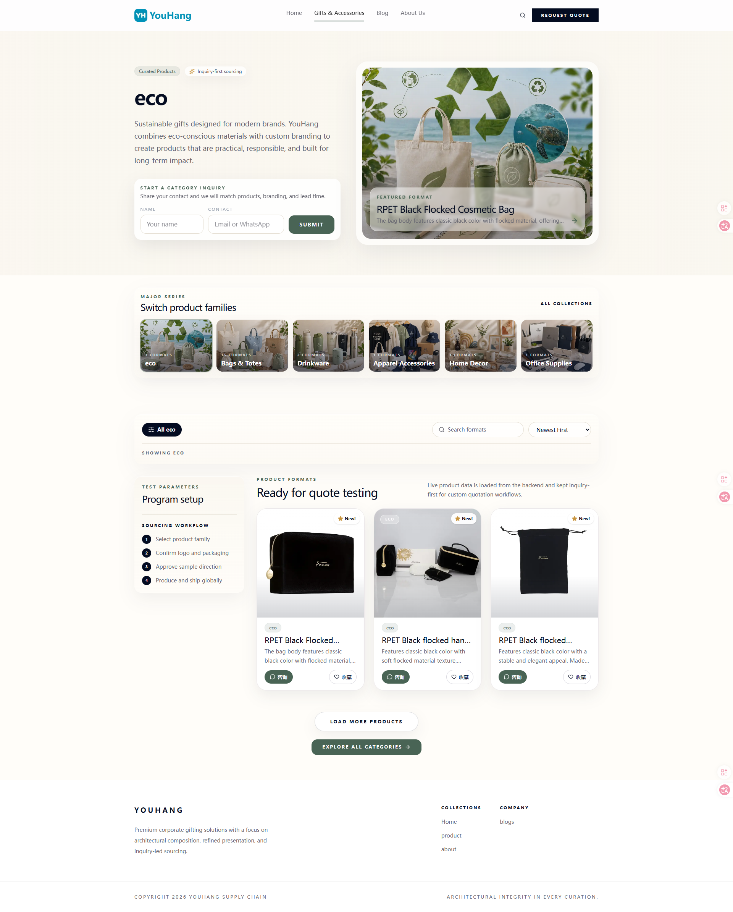
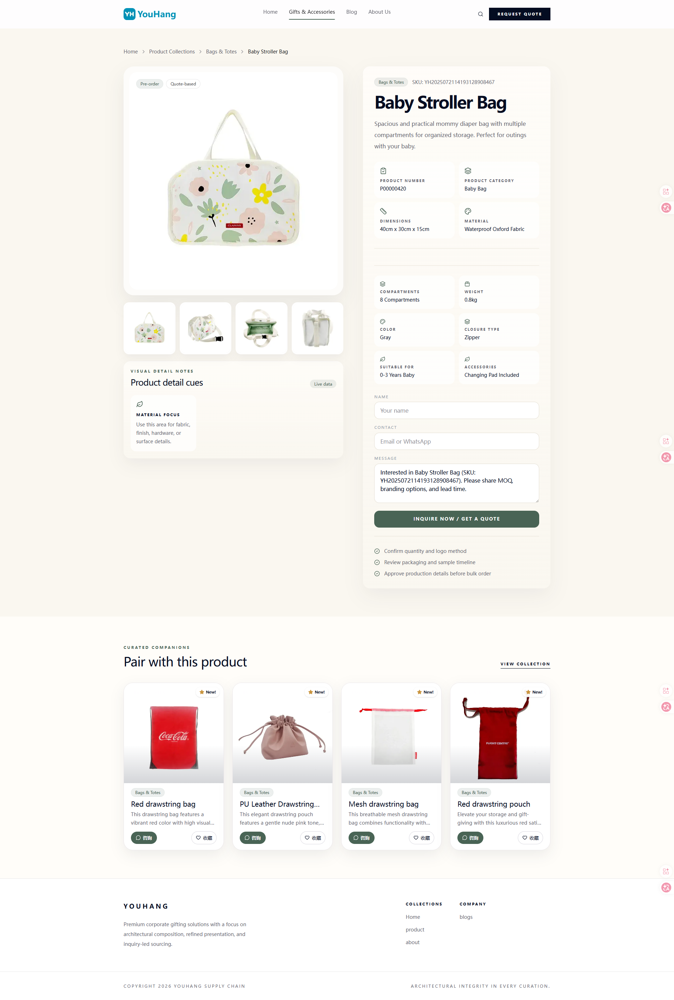
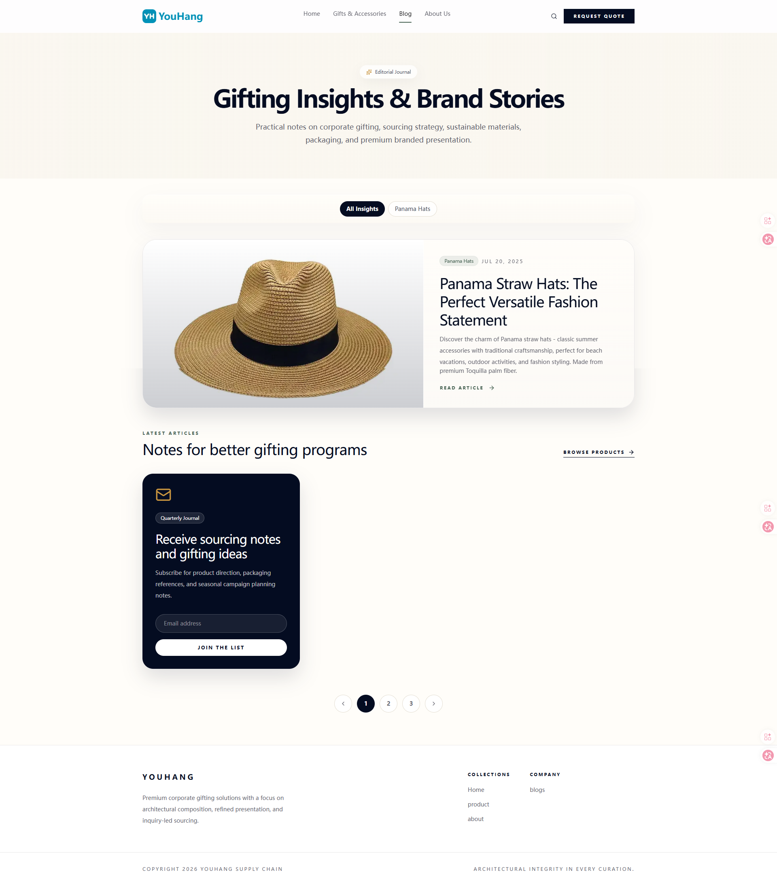
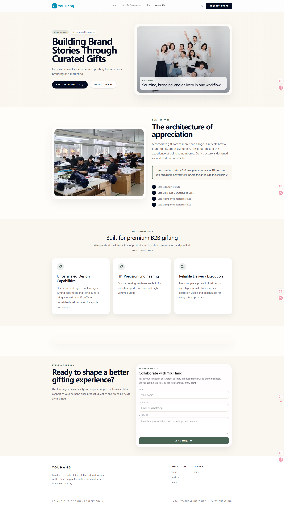

# nuxt3GiftTemplate

`nuxt3GiftTemplate` 是一个基于 `Nuxt 3` 构建的企业展示型网站模板，适用于礼品定制、促销品、包装配件、跨境供应链展示等业务场景。

这个项目已经按开源仓库方向整理过，包含完整的首页、产品系列页、产品详情页、博客页和关于我们页，适合作为企业官网模板、产品展示站模板或营销型网站模板继续开发。

## 项目预览

### 1. 主页



### 2. 产品系列主页



### 3. 产品系列子页



### 4. 产品详情页



### 5. 博客页



### 6. 关于我们页



## 这个网站是做什么的

这个网站模板主要用于以下类型的业务：

- 企业官网展示
- 产品目录展示
- 产品详情介绍
- 内容营销与 SEO 博客
- 品牌故事与公司介绍
- 询盘收集与客户沟通入口

适合的行业场景包括：

- 礼品定制公司
- 促销品公司
- 包装与配件供应商
- B2B 外贸展示站
- 轻量型品牌官网

## 项目特点

- 基于 `Nuxt 3` 构建，适合继续二次开发
- 页面结构完整，适合直接改造成企业官网
- 包含产品分类、产品详情、博客、关于我们等常见页面
- 已整理 SEO 相关逻辑，便于搜索引擎收录
- 支持响应式布局，适配桌面端与移动端
- 已补充接口字段文档，方便前后端联调
- 已进行匿名化处理，适合整理后公开开源

## 技术栈

- Nuxt 3
- Vue 3
- TypeScript
- Tailwind CSS
- Pinia
- Nuxt SEO / Sitemap

## 目录结构

```text
.
├─ apis/              # 前端接口封装
├─ assets/            # 静态资源、样式、图标
├─ components/        # 公共组件
├─ composables/       # 可复用逻辑
├─ middleware/        # 路由中间件
├─ pages/             # 页面文件
├─ plugins/           # Nuxt 插件
├─ types/             # 类型定义
├─ API_FIELDS_DOC.md  # 提供给后端的接口字段文档
└─ GLOBAL_REFACTOR_TODO.md
```

## 本地启动

安装依赖：

```bash
npm install
```

启动开发环境：

```bash
npm run dev
```

生产构建：

```bash
npm run build
```

本地预览生产版本：

```bash
npm run preview
```

## 使用前需要修改的内容

如果你要把这个模板用于真实项目，建议优先修改以下内容：

- `package.json` 中的项目基础信息
- `app.config.ts` 中的站点名称
- `nuxt.config.ts` 中的域名、接口地址、统计配置
- `pages/` 目录中的 SEO 标题和描述
- 联系方式、公司介绍、品牌名称
- API 对接地址和环境变量

## 接口文档

前端当前所需的接口字段，已经整理在下面这个文件中：

- [API_FIELDS_DOC.md](./API_FIELDS_DOC.md)

这个文件可以直接发给后端同事，用来确认字段结构和接口返回内容。

## 开源说明

这个仓库已经按照开源方向进行整理。

为了避免暴露历史业务信息，仓库中的部分品牌和公司信息已替换为占位内容，例如：

- 品牌占位名：`Virtual Company`
- 域名占位：`virtual-company.example`

如果你要把这个模板用于真实业务，请替换成你自己的公司信息、品牌文案和生产环境配置。

## 适合谁使用

如果你有以下需求，这个模板比较适合你：

- 想快速搭建一个企业展示官网
- 想做产品目录和详情展示
- 想要博客页面配合 SEO 做内容营销
- 想找一个 Nuxt 3 的营销站模板做二次开发

## License

当前仓库适合作为开源模板继续整理发布。

如果你准备正式公开，请补充你自己的 `LICENSE` 文件。
